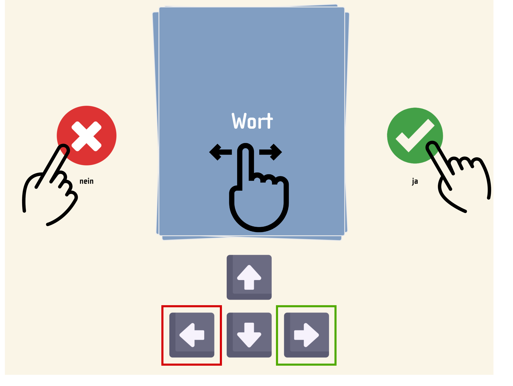

##  PREVIC: Parent Report of Expressive Vocabulary in Children

Bohn, M., Prein, J., Engicht, J., Haun, D., Gagarina, N., & Koch, T. (2025). PREVIC: An adaptive parent report measure of expressive vocabulary in children between 3 and 8 years of age. _Behavior Research Methods, 57_(3), 95. https://doi.org/10.3758/s13428-025-02615-4

### Usage
Link to task (in German): [PREVIC](https://ccp-odc.eva.mpg.de/previc-demo/)

### Description
Here, we present the PREVIC (Parent Report of Expressive Vocabulary in Children), an open-access, high-quality vocabulary
checklist for German-speaking children between 3 and 8 years of age. The PREVIC was constructed leveraging the advan-
tages of item response theory: we designed a large initial item pool of 379 words and collected data from 1190 caregivers
of children between 3 and 8 years of age. Based on these data, we computed a range of fit indices for each item (word) and
used an automated item selection algorithm to compile a final pool that contains items that (a) vary in difficulty and (b) fit
the Rasch (one-parameter logistic) model. The resulting task is highly reliable and shows convergent validity. The IRT-based
construction allowed us to design an adaptive version of the task that substantially reduces the task duration while retaining
measurement precision. The PREVIC fills an important gap in the toolkit of researchers interested
in language development and provides an ideal starting point for developing converging measures in other languages.



### Project Structure

```
.
├── adaptivetesting             <-- scripts for maximum likelihood estimations
├── public                      
    ├── data                    <-- scripts for uploading data to server
    ├── images                  <-- logos etc. 
    ├── all html pages          <-- index, instructions, questionnaire and goodbye page
├── src                         <-- folder containing all CSS and JavaScript for functionality
└── ...some more config files                      

```


### Development

Development requires [Node.js](https://nodejs.org/en/)

#### Local Development

1. `git clone git@github.com:ccp-eva/orev-demo.git`
1. `npm install`
1. `npm start`

#### Deploy Application To A Server

1. `git clone git@github.com:ccp-eva/orev-demo.git`
1. `npm install`
1. `npm run build`
1. Upload the contents within the `dist` folder to your web hoster.
